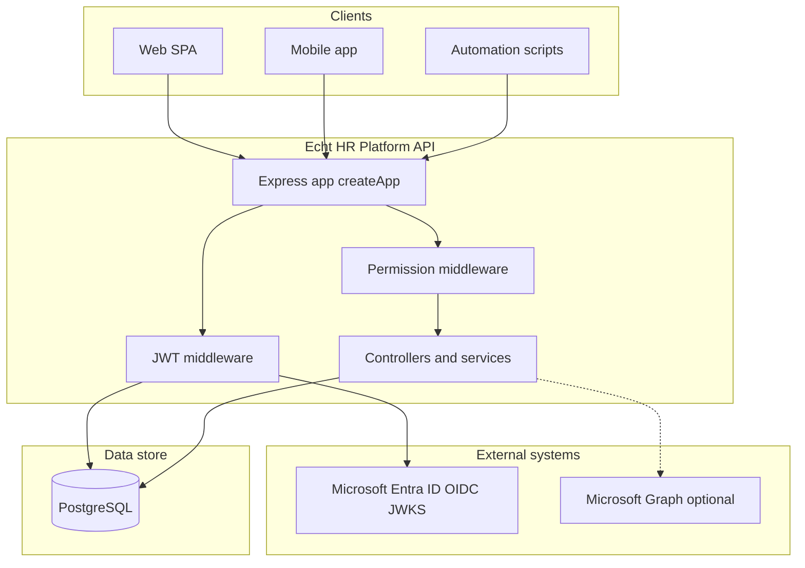
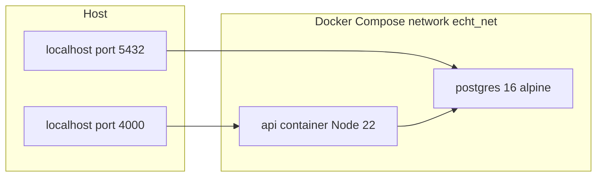
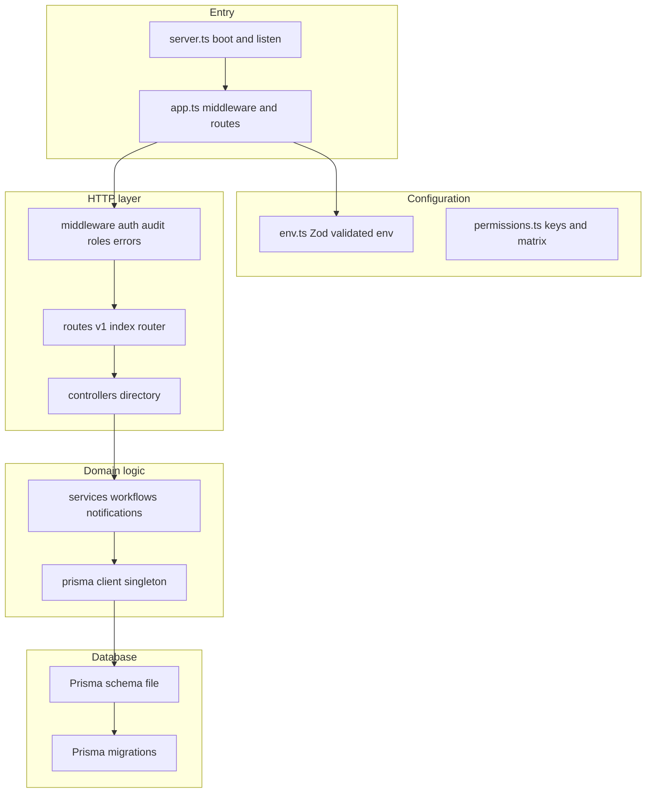
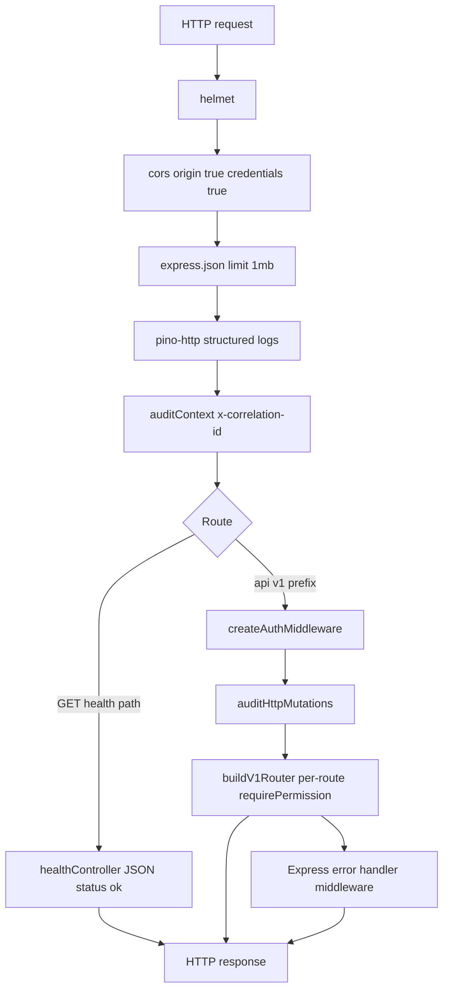
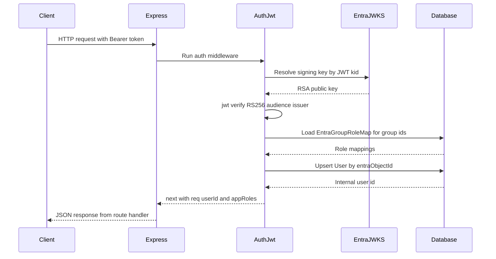
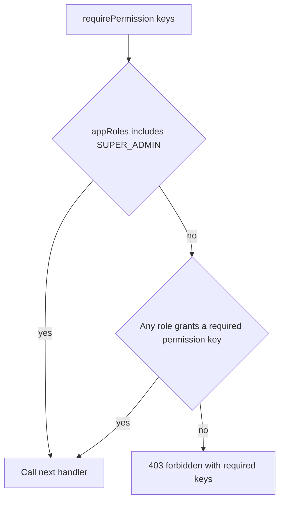
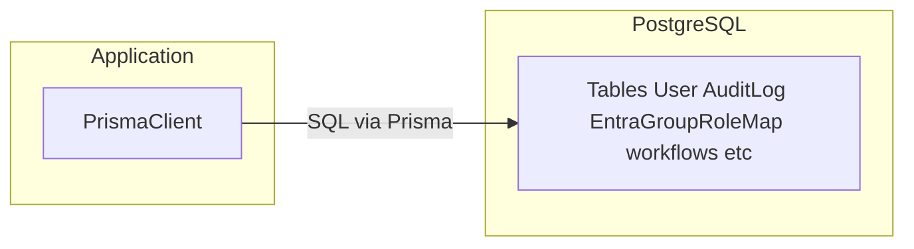
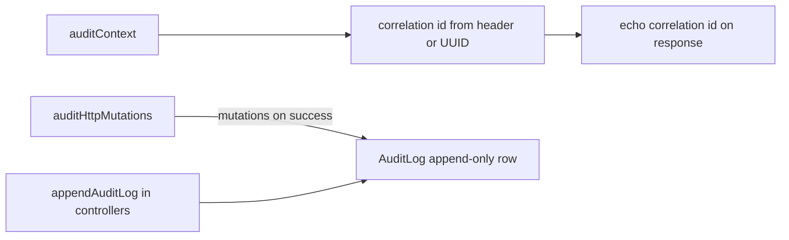
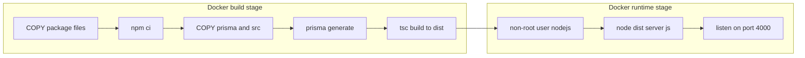

# Echt HR Platform API

Backend API for **Echt Environmental Service Limited** — HR and departmental process automation. The service is an **Express 5** application written in **TypeScript**, using **Prisma** against **PostgreSQL**, with **Microsoft Entra ID** (Azure AD) **Bearer JWT** validation. There are no end-user passwords stored in the database; identity is anchored on Entra object IDs and tokens.

This document is written for developers who will run, extend, or operate the API.

---

## Table of contents

1. [What this service does](#what-this-service-does)
2. [System architecture](#system-architecture)
3. [Repository layout](#repository-layout)
4. [Runtime request pipeline](#runtime-request-pipeline)
5. [Authentication and identity](#authentication-and-identity)
6. [Authorization (RBAC)](#authorization-rbac)
7. [HTTP API reference](#http-api-reference)
8. [Data layer and Prisma](#data-layer-and-prisma)
9. [Auditing and correlation IDs](#auditing-and-correlation-ids)
10. [Configuration](#configuration)
11. [Local development](#local-development)
12. [Docker and production image](#docker-and-production-image)
13. [Scripts](#scripts)
14. [Troubleshooting](#troubleshooting)
15. [Security notes](#security-notes)

---

## What this service does

- Exposes a **versioned JSON API** under `/api/v1`.
- Validates **access tokens** issued by Entra ID (OIDC, RS256, JWKS).
- Resolves **application roles** from Entra **group** claims via the `EntraGroupRoleMap` table (see `prisma/schema.prisma`).
- **Upserts** a `User` row on each authenticated request so the internal `userId` stays aligned with the token.
- Enforces **fine-grained permissions** per route (`src/config/permissions.ts` + `src/middleware/requireRole.ts`).
- Records **append-only audit** rows for mutating HTTP methods and supports explicit audit calls from controllers (`src/middleware/auditMiddleware.ts`).
- Ships optional **notification** plumbing (e.g. Microsoft Graph email adapter under `src/services/notification/`).

---

## System architecture

High-level relationships between clients, this API, identity, optional Graph calls, and PostgreSQL.



**Docker Compose** (development-style stack: API + Postgres on a shared bridge network):



---

## Repository layout

How source files are grouped and what each area is responsible for.



Note: diagram uses short labels; real paths are under `prisma/schema.prisma` and `prisma/migrations`.

| Path | Role |
|------|------|
| `src/server.ts` | Loads `dotenv`, validates environment, creates the app, listens on `PORT`. |
| `src/app.ts` | Composes global middleware, registers `/health` and `/api/v1`, mounts `errorHandler`. |
| `src/config/env.ts` | Zod schema for required variables; fails fast at boot if invalid. |
| `src/config/permissions.ts` | Permission string constants and `ROLE_PERMISSIONS` matrix. |
| `src/middleware/authJwt.ts` | Bearer JWT verification via JWKS; user upsert; `req.auth`, `req.appRoles`, `req.userId`. |
| `src/middleware/requireRole.ts` | `requirePermission`, `requireAnyAppRole`, HR-sensitive attendance helper. |
| `src/middleware/auditMiddleware.ts` | Correlation ID; HTTP mutation audit; `appendAuditLog` for rich audits. |
| `src/routes/v1/index.ts` | All v1 routes and their permission gates. |
| `src/controllers/` | Thin handlers calling Prisma or services. |
| `src/services/` | Workflow engine, attendance sync, geofence, notifications, etc. |
| `src/types/express.d.ts` | Augments `Express.Request` with `auth`, `appRoles`, `userId`, `correlationId`. |
| `prisma/` | Schema and migrations; single source of truth for models and enums like `AppRole`. |

---

## Runtime request pipeline

Order matters: global middleware runs first; `/health` is a dedicated route; everything under `/api/v1` runs JWT auth then the v1 router.



---

## Authentication and identity

The auth middleware validates the JWT, resolves signing keys from Entra JWKS, maps group IDs to `AppRole` values, and upserts the `User` record.



Missing or invalid tokens return **401** before the database steps; the diagram shows the **happy path** only.

**Developer-facing details:**

- **JWKS URI** is derived from `AZURE_AD_TENANT_ID`: `https://login.microsoftonline.com/{tenant}/discovery/v2.0/keys` (see `src/middleware/authJwt.ts`).
- **`jwt.verify`** options: `audience` = `AZURE_AD_AUDIENCE`, `issuer` = `AZURE_AD_ISSUER`, algorithm **RS256** only.
- **Groups**: token must include `groups` (or they will be empty); each group GUID can map to one or more `AppRole` rows in `EntraGroupRoleMap`.
- **User row**: created or updated on every successful auth so downstream code always has `req.userId` (UUID).

---

## Authorization (RBAC)

Route handlers use `requirePermission(Permission.SOME_KEY)` (or specialized helpers). `SUPER_ADMIN` bypasses all permission checks.



- **Permission keys** are string constants such as `self.profile`, `audit.read`, `hr.attendance.read_sensitive` (see `Permission` in `src/config/permissions.ts`).
- **`roleHasPermission(role, key)`** implements the matrix lookup.
- Some routes use **`requireHrSensitiveAttendance`**, which maps to `Permission.HR_ATTENDANCE_READ_SENSITIVE` (HR Admin and Super Admin in the matrix).

---

## HTTP API reference

Base URL in local Docker: `http://localhost:4000`. Authenticated routes need header: `Authorization: Bearer <access_token>`.

| Method | Path | Auth | Permission / gate | Notes |
|--------|------|------|-------------------|--------|
| `GET` | `/health` | No | — | Liveness; returns `{ status, service }`. |
| `GET` | `/api/v1/me` | Yes | `SELF_PROFILE` | Current user profile from DB. |
| `GET` | `/api/v1/audit/logs` | Yes | `AUDIT_READ` | Audit log query (async handler). |
| `POST` | `/api/v1/hr/leave` | Yes | `SELF_LEAVE` | Submit leave request. |
| `GET` | `/api/v1/hr/leave/me` | Yes | `SELF_LEAVE` | List own leave. |
| `POST` | `/api/v1/attendance/clock` | Yes | `SELF_ATTENDANCE` | Clock event. |
| `POST` | `/api/v1/attendance/clock/sync` | Yes | `SELF_ATTENDANCE` | Batch sync. |
| `GET` | `/api/v1/attendance/users/:userId/clock-events` | Yes | `HR_ATTENDANCE_READ_SENSITIVE` | HR-sensitive read. |
| `GET` | `/api/v1/it/tickets` | Yes | `IT_TICKET_READ_ALL` | **Stub** returns `{ items: [] }`. |
| `GET` | `/api/v1/finance/requests` | Yes | `FINANCE_READ` | **Stub** `{ items: [] }`. |
| `GET` | `/api/v1/ops/pipeline` | Yes | `OPS_READ` | **Stub** `{ items: [] }`. |
| `GET` | `/api/v1/payroll/runs` | Yes | `HR_PAYROLL_READ` | **Stub** `{ items: [] }`. |
| `GET` | `/api/v1/reports/summary` | Yes | `REPORTING_READ` | **Stub** `{ summary: {} }`. |

**Errors:** `src/middleware/errorHandler.ts` returns JSON `{ error, message }`. HTTP **409** is used when `code === "WORKFLOW_ILLEGAL_TRANSITION"`; otherwise unhandled errors tend to map to **500**.

---

## Data layer and Prisma

- **Connection**: `DATABASE_URL` in environment (validated in `src/config/env.ts`).
- **Client**: `src/lib/prisma.ts` exports a singleton `PrismaClient`; in non-production it is pinned on `globalThis` to survive dev hot reloads.
- **Logging**: query logging enabled in `development` only.
- **Migrations**: live under `prisma/migrations/`; use `prisma migrate dev` locally and `prisma migrate deploy` in containers or CI.



---

## Auditing and correlation IDs



- **Correlation**: Every request gets a `correlationId` echoed as **`X-Correlation-Id`** for tracing across services.
- **HTTP mutation audit**: On successful responses (status less than 400) for mutating verbs, a lightweight `AuditLog` row is written in the `finish` callback (failures are swallowed so responses are not broken).
- **Rich audits**: Prefer `appendAuditLog` after business mutations with structured `before` / `after` payloads.

---

## Configuration

Environment variables are validated at startup with **Zod** (`src/config/env.ts`). Copy `.env.example` to `.env` and set real values.

| Variable | Required | Purpose |
|----------|----------|---------|
| `NODE_ENV` | Default `development` | `development`, `test`, or `production`. |
| `PORT` | Default `4000` | HTTP listen port. |
| `DATABASE_URL` | Yes | PostgreSQL connection string for Prisma. |
| `PUBLIC_API_URL` | No | Optional public base URL (must be valid URL if set). |
| `AZURE_AD_TENANT_ID` | Yes | Tenant GUID for JWKS and token context. |
| `AZURE_AD_CLIENT_ID` | Yes | App registration client id (used in broader Azure config). |
| `AZURE_AD_ISSUER` | Yes | Token issuer URL (v2.0 OIDC). |
| `AZURE_AD_AUDIENCE` | Yes | Expected JWT `aud` (often `api://{client-id}`). |
| `MS_GRAPH_TENANT_ID` | No | Graph application auth. |
| `MS_GRAPH_CLIENT_ID` | No | Graph client id. |
| `MS_GRAPH_CLIENT_SECRET` | No | Graph client secret. |

**Docker Compose** reads `.env` for the `api` service and uses `POSTGRES_USER`, `POSTGRES_PASSWORD`, `POSTGRES_DB` for the `postgres` service. Compose overrides `DATABASE_URL` inside the `api` container to point at the `postgres` hostname.

**Logging:** `LOG_LEVEL` is read by `pino` in `src/app.ts` (optional, defaults to `info`).

---

## Local development

1. Install dependencies: `npm ci`
2. Copy `cp .env.example .env` and set `DATABASE_URL` to a local Postgres instance (and all Azure AD variables).
3. `npm run prisma:generate`
4. `npm run prisma:migrate` (creates or updates schema in dev)
5. `npm run dev` (runs `tsx watch src/server.ts`)

The dev server loads `dotenv` before `loadEnv()` in `server.ts`, so `.env` in the project root is picked up automatically.

---

## Docker and production image

**Typical commands:**

```bash
cp .env.example .env
docker compose up -d --build
docker compose run --rm api npx prisma migrate deploy
```

- **API URL:** `http://localhost:4000`
- **Postgres port:** `5432` on the host (see `docker-compose.yml`)

Multi-stage image build and runtime:



---

## Scripts

| Script | Command | Description |
|--------|---------|-------------|
| Dev server | `npm run dev` | `tsx watch src/server.ts` with reload. |
| Build | `npm run build` | `tsc -p tsconfig.build.json` outputs to `dist/`. |
| Start | `npm start` | `node dist/server.js` (production). |
| Prisma client | `npm run prisma:generate` | `prisma generate`. |
| Migrations (dev) | `npm run prisma:migrate` | `prisma migrate dev`. |

In Docker after code or schema changes, rebuild with `docker compose up -d --build` and run `migrate deploy` as needed.

---

## Troubleshooting

| Symptom | Likely cause | What to check |
|---------|----------------|---------------|
| Process exits immediately on start | Invalid `.env` | Zod error message lists missing or invalid fields. |
| 401 on all v1 routes | Token or Azure config | Bearer header present; `AZURE_AD_ISSUER`, `AZURE_AD_AUDIENCE`, tenant; token not expired; API app registration exposes correct scope. |
| 403 on specific routes | RBAC | Entra groups on token; rows in `EntraGroupRoleMap` for those group object IDs; `ROLE_PERMISSIONS` in code. |
| Empty `appRoles` | No group claims or no DB maps | Token configuration for **groups** claim; seed or migrate `EntraGroupRoleMap`. |
| DB connection errors from API container | Wrong credentials or Postgres not healthy | `depends_on` healthcheck; `POSTGRES_PASSWORD` matches URL; `DATABASE_URL` in compose environment. |
| Prisma errors after pull | Schema drift | Run `npm run prisma:migrate` locally or `npx prisma migrate deploy` in the container. |

---

## Security notes

- **Never commit `.env`**; it contains secrets and is referenced by Docker Compose.
- **JWTs**: Treat access tokens as secrets; use HTTPS in all non-local deployments.
- **Helmet** and **CORS** are enabled globally; adjust `cors` options if you need a strict allowlist in production.
- **JSON body limit** is **1 MB**; increase in `src/app.ts` only if you have a clear requirement.
- Replace **placeholder** Azure AD values in `.env.example` before using real tenant data in shared environments.

---

## Package metadata

- **Package name:** `echt-hr-platform-api` (`package.json`)
- **Module system:** ESM (`"type": "module"`); compiled imports use `.js` extensions in TypeScript sources pointing at emitted files.
